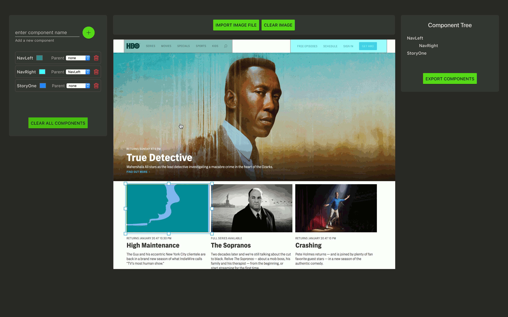
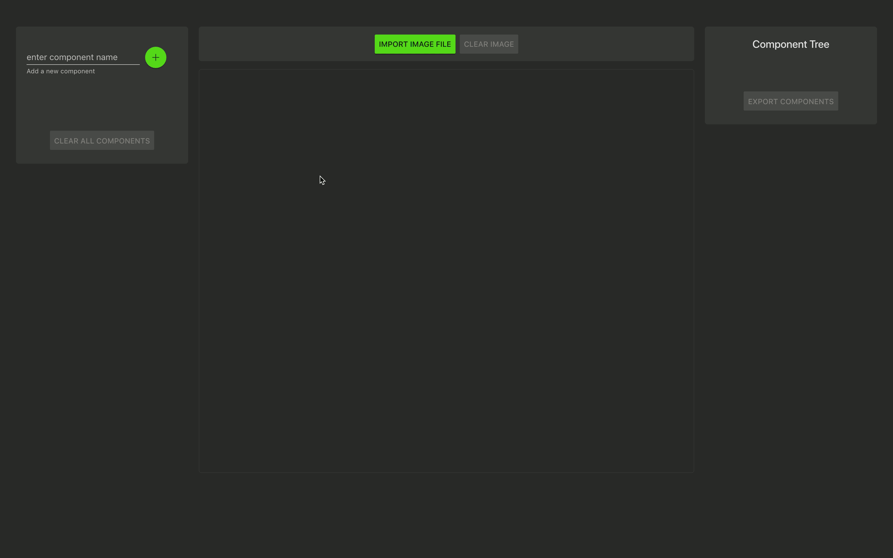

# preVuer
**preVuer** is a *prototyping tool for Vue developers* to quickly create component template files

preVuer enables developers to translate UI design mock-ups into single-page-applications, visualizing component position and parent/child relationships. Simply import your image, create and customize your components, and export ready-to-use .vue template files.
<a href="https://github.com/preVuer-org/preVuer"></a>

## Installation
*downloadable executable coming soon!*

As of now, to use our application on your local machine, please clone from this repo and run our start command:
```
git clone https://github.com/preVuer-org/preVuer
npm start
```

## How to use preVuer
Once preVuer has opened up, you'll see that it is split up into three sections: 

- **Left Section**: *add, edit, delete components*
  - To create a component, enter the title of your component and click the "+" button (or hit enter on your keyboard).
  - Once entered, an item appears in the **Left Section** with the component’s name, a color box, select dropdown, and delete button. A corresponding box appears in the **Middle Section** of the application.
  - For each *preVuer* component, you can change the color the of box, select a parent or delete the component itself.
  - If you want to start over, click **Clear All Components** to start again with a clean slate.
<a href="https://github.com/preVuer-org/preVuer"></a>
<a href="https://github.com/preVuer-org/preVuer"></a>

- **Middle Section**: *import image, move and resize Vue component box*
  - Use **Import Image File** to import and display a UI mock-up in the **Middle Section**. Clicking this button will open a dialog box, prompting you to select the image file on your local machine. To clear the image, use the **Clear Image** button.
  - Use **Export Components** to convert your *preVuer* components into .vue template files. Clicking will open a dialog, prompting you to select an export destination on your local machine. 
<a href="https://github.com/preVuer-org/preVuer"></a>

- **Right Section**: *component tree, export files*
  - The **Component Tree** provides an intuitive representation of parent/child relationships assigned in the **Left Section**. 
  - As you finish building out the components, you can export the files with the "**Export Components**" button. This will generate a folder and then fill it with all the components you used in prototyping. 
<a href="https://github.com/preVuer-org/preVuer"></a>

## Built with
- [Vue](https://vuejs.org/)
- [Vuex](https://vuex.vuejs.org/)
- [Vue Material](https://vuematerial.io/)
- [KonvaJS/Vue-Konva](https://github.com/konvajs/vue-konva)
- [Electron](https://electronjs.org/)
- [Jest](https://jestjs.io/)

## Contributors
#### Original developers
- [Chris F](https://github.com/chrisfranz)
- [EB](https://github.com/evgenii-codesmith)
- [Jim Y](https://github.com/orenJim)
#### Community contributors
